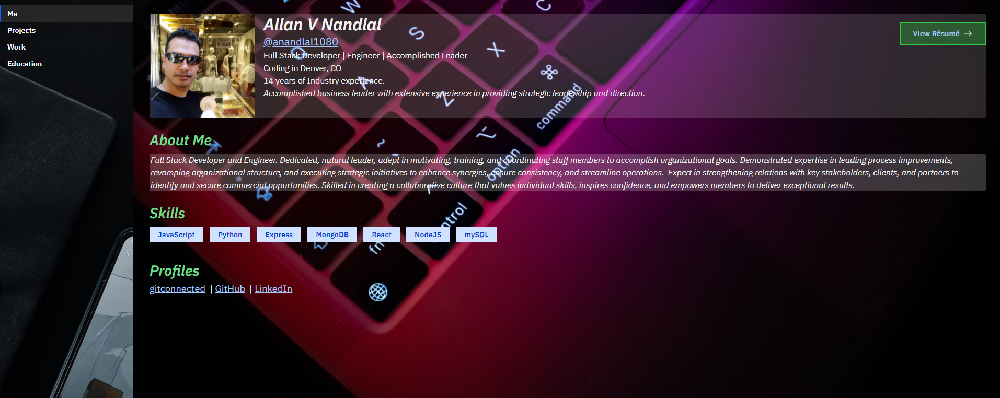

# Portfolio

Portfolio is an application that contains all information about me.

Checkout the [Deployed app here](https://portfolio.allannandlal.com/).

## Table of Contents

- [Installation](#installation)
- [Usage](#usage)
- [Technologies](#technologies)
- [License](#license)
- [Questions](#questions)

## Installation

Just simply go to this [Link](https://portfolio.allannandlal.com/) or, if your prefer, copy this link https://portfolio.allannandlal.com/ and paste in your browser.

## Usage

- Gif:

- Description:

As a user, you will be able to review my portfolio [Here](https://portfolio.allannandlal.com/).

## Technologies

This application utilizes `React`, `Bootstrap`,`Netlify`, `CSS`, `Gitconnected.com`, `react-animations`, `material-ui`.

## Scripts

In the project directory, you can run:

### `npm start`

Runs the app in the development mode.

Open [http://localhost:3000](http://localhost:3000) to view it in the browser.

## License

## Questions

If you have any questions or concerns, feel free to contact me via:

GitHub: [anandlal1080](https://github.com/anandlal1080)

Email: allan@allannandlal.com
